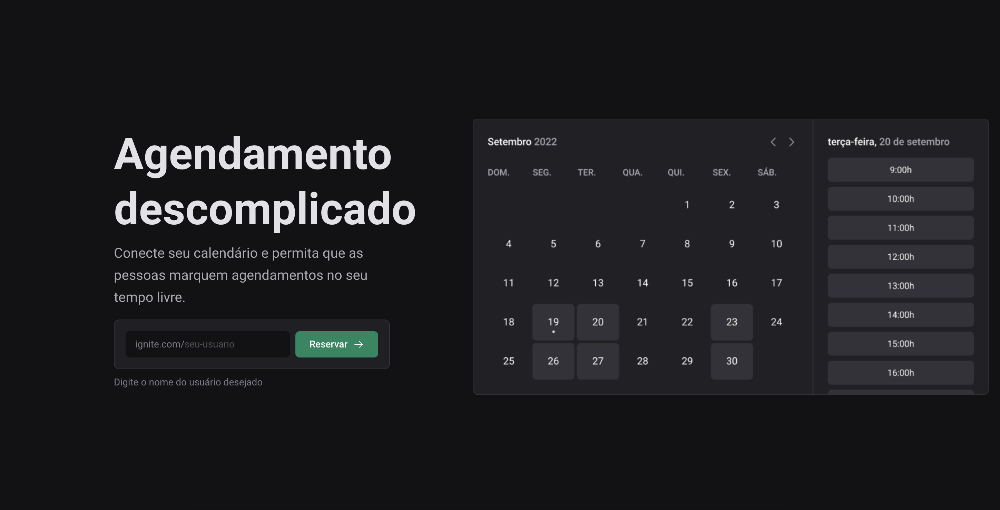
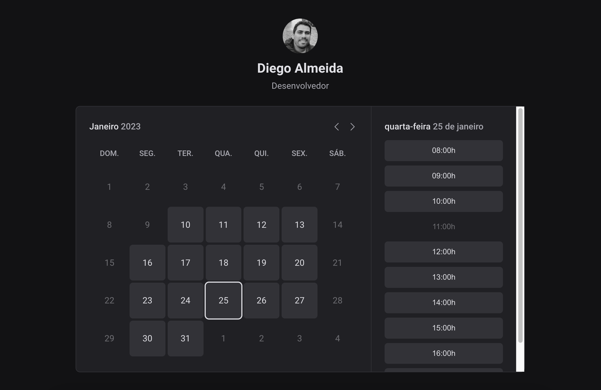
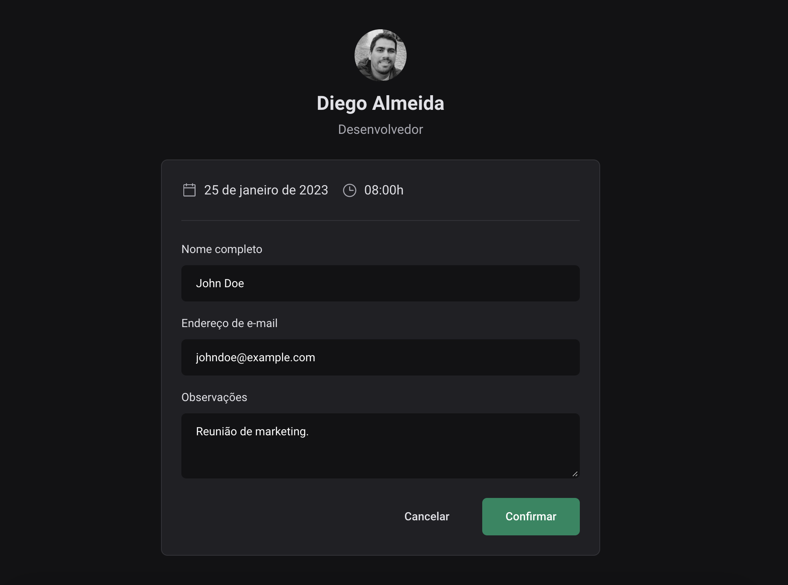

<h1 align="center">
  Ignite Call
</h1>

<p align="center">
  <a href="#-tecnologias">Tecnologias</a>&nbsp;&nbsp;&nbsp;|&nbsp;&nbsp;&nbsp;
  <a href="#-projeto">Projeto</a>&nbsp;&nbsp;&nbsp;|&nbsp;&nbsp;&nbsp;
  <a href="#-executando">Executando</a>&nbsp;&nbsp;&nbsp;
</p>

<p align="center">
 

  
</p>

<br>

<p align="center">
  
</p>

<p align="center">
  
</p>

<p align="center">
  
</p>

## 🚀 Tecnologias

Esse projeto foi desenvolvido com as seguintes tecnologias:

- React
- Next.js
- Typescript
- Node.js
- Prisma.io
- Google APIs
- Google Cloud Platform
- Docker
- Axios
- Next Seo
- Nookies
- React Hook Form
- Design System
- Stitches (CSS-in-JS)
- Phosphor icons
- ESLint
- Date-fns
- Zod

## 🔖 Projeto

O projeto Ignite Call foi construído para agendamentos de compromissos a partir de um calendário com integração com o Google Agenda. O usuário pode se cadastrar no app a partir de sua conta do Google e indicar seus dias da semana e horários em que estará disponível para agendar compromissos. Todo agendamento cadastrado na aplicação tem integração com o Google Agenda, o qeu possibilita ao usuário verificar seus novos compromissos direto na plataforma do Google.

O Ignite Call foi construído inteiramente em um projeto Next.js e utilizado os mecanismos fornecidos pelo framework para criação e integração do front-end e do back-end a partir de um único repositório de código. A comunicação da aplicação com o banco de dados foi feita com o uso da ferramenta Prisma.io e utilizado um banco de dados MySQL em um container Docker. O banco de dados de produção foi publicado a partir do serviço da plataforma PlanetScale e foi utilizado o serviço da Vercel para hospedagem da aplicação.


## 💻 Executando

O projeto foi criado utilizando o ambiente de desenvolvimento `Next.js`. Para maiores informações consultar [documentação](https://nextjs.org/docs).

Para rodar a aplicação será necessária a conexão com um banco de dados local ou container Docker e integrado com a ferramenta Prisma.io. Além da criação do projeto no Google Cloud Platform para coletar as credenciais necessárias para login e integração com a plataforma Google que constam no arquivo `.env.example`. Este arquivo também contém a URL de conexão que deverá ser utilizada para a conexão do Prisma com o banco de dados.

```sh
  # Clone this project
$ git clone git@github.com:diegoalmda/nextjs-ignite-call.git
# Install dependencies
$ npm install
# Run the project
$ npm run dev
# The server will initialize in the <http://localhost:3000>
```
Testar o projeto em funcionamento -> [Ignite Call](https://nextjs-ignite-call.vercel.app/)

Feito por Diego Almeida :wave: #TrilhaIgnite #Rocketseat 🚀